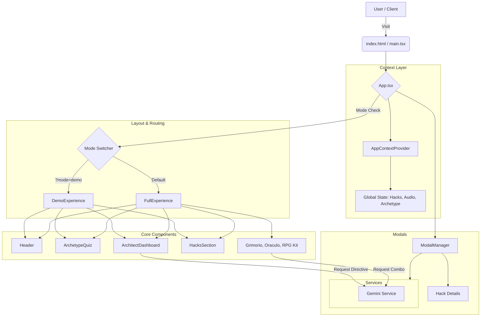

# Chalamandra Magistral: Cognitive Operating System for the Elite 1%


> **Strategic Note:** This repository hosts the source code for the "Chalamandra Magistral" platform. It is designed as a scalable, component-based React application that decodes cognitive archetypes and delivers elite mental hacking protocols.

## 🚀 Overview

Chalamandra Magistral is more than a web app; it's a **cognitive operating system**. Users engage in a deep psychological quiz to determine their archetype (Architect, Alchemist, Explorer), unlocking a personalized dashboard of "Hacks" (mental models), tactical grimoires, and AI-powered strategic directives.

### Key Features
- **Archetype Decoding Engine:** Interactive quiz with complex scoring logic.
- **Dynamic Dashboard:** Personalized content delivery based on user archetype.
- **AI Oracle:** Integration with Google Gemini for real-time strategic advice.
- **Tactical Audio:** Immersive soundscapes using Tone.js for "SRAP" rituals.
- **Dual Mode Experience:** "Demo" vs. "Full" experience toggle for conversion optimization.

## 🛠 Tech Stack

- **Core:** React 18, TypeScript, Vite
- **Styling:** Tailwind CSS (Utility-first, scalable design system)
- **AI Integration:** Google GenAI SDK (Gemini Models)
- **Audio Synthesis:** Tone.js (Real-time procedural audio)
- **State Management:** React Context API + Custom Hooks
- **Icons:** FontAwesome

## 🏗 Architecture & Flow

The application follows a modular, feature-based architecture within `src/` to ensure maintainability and scalability.



## ⚡ Performance & UX Strategy

- **Lazy Loading:** Modal content is loaded on demand to keep the initial bundle light.
- **Audio Context Management:** Audio context is initialized only after user interaction to comply with browser autoplay policies.
- **Optimized Assets:** Centralized CSS and minimal external dependencies ensure fast FCP (First Contentful Paint).
- **Responsive Design:** Mobile-first approach using Tailwind's responsive modifiers.

## 🛡 Security & Scalability

- **Environment Variables:** API Keys are strictly managed via `.env` files (see `.env.example`). **NEVER commit keys to the repo.**
- **Input Sanitization:** Although client-side, inputs for the AI prompts are constructed via template literals in controlled service functions to minimize injection risks.
- **Modular Codebase:** The separation of `layout`, `components`, `services`, and `context` allows for easy addition of new features (e.g., new archetypes or hacks) without refactoring the core logic.

## 🚀 Installation & Deploy

### Prerequisites
- Node.js v18+
- npm or yarn

### Local Development

1.  **Clone the Repository:**
    ```bash
    git clone https://github.com/your-org/chalamandra-magistral.git
    cd chalamandra-magistral
    ```

2.  **Install Dependencies:**
    ```bash
    npm install
    ```

3.  **Configure Environment:**
    Create a `.env` file in the root:
    ```env
    VITE_GEMINI_API_KEY=your_gemini_api_key_here
    ```

4.  **Run Development Server:**
    ```bash
    npm run dev
    ```
    Access the app at `http://localhost:5173`.

### Deployment (Vercel/Netlify)

This project is Vite-based and deploys seamlessly to edge platforms.

1.  **Build Command:** `npm run build`
2.  **Output Directory:** `dist`
3.  **Environment Variables:** Add `VITE_GEMINI_API_KEY` to your project settings in the dashboard.

## 🧪 Testing

Currently, the project relies on manual verification.
- **Unit Tests:** Future roadmap includes Vitest for `utils` and `services`.
- **E2E:** Playwright tests are recommended for critical flows (Quiz completion, Payment modal).

## 🔮 Strategic Vision (Senior Engineer Notes)

1.  **Micro-Frontend Potential:** As the "Hacks" library grows, considering splitting the "Dashboard" and the "Public Site" into separate builds could improve performance.
2.  **Server-Side Rendering (SSR):** Migrating to Next.js or Remix in the future would improve SEO for the content-heavy sections (Hacks descriptions, Blog).
3.  **Gamification Engine:** The current state is local. Moving `completedHacks` to a backend (Supabase/Firebase) would allow for persistent user profiles and cross-device synchronization.

---

*“The only limit to your reality is the architecture of your mind.”* - Chalamandra Protocol
