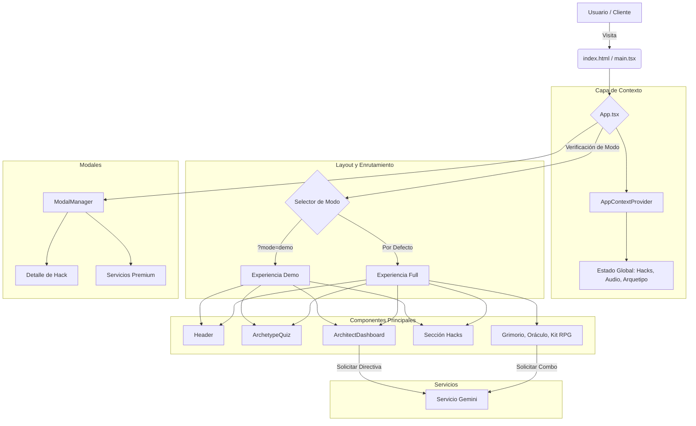

# Chalamandra Magistral: Sistema Operativo Cognitivo


> **Nota Estratégica:** Este repositorio aloja el código fuente de la plataforma "Chalamandra Magistral". Está diseñado como una aplicación React escalable basada en componentes que decodifica arquetipos cognitivos y entrega protocolos de hacking mental de élite.

## 🚀 Visión General

Chalamandra Magistral es más que una aplicación web; es un **sistema operativo cognitivo**. Los usuarios participan en un test psicológico profundo para determinar su arquetipo (Arquitecto, Alquimista, Explorador), desbloqueando un tablero personalizado de "Hacks" (modelos mentales), grimorios tácticos y directivas estratégicas impulsadas por IA.

### Características Clave
- **Motor de Decodificación de Arquetipos:** Cuestionario interactivo con lógica de puntuación compleja.
- **Tablero Dinámico:** Entrega de contenido personalizado basado en el arquetipo del usuario.
- **Oráculo IA:** Integración con Google Gemini para asesoramiento estratégico en tiempo real.
- **Audio Táctico:** Paisajes sonoros inmersivos usando Tone.js para rituales "SRAP".
- **Experiencia Dual:** Cambio entre modo "Demo" y "Full" para optimización de conversiones.

## 🛠 Tecnologías

- **Núcleo:** React 18, TypeScript, Vite
- **Estilos:** Tailwind CSS (Sistema de diseño utilitario y escalable)
- **Integración IA:** Google GenAI SDK (Modelos Gemini)
- **Síntesis de Audio:** Tone.js (Audio procedural en tiempo real)
- **Gestión de Estado:** React Context API + Custom Hooks
- **Iconos:** FontAwesome

## 🏗 Arquitectura y Flujo

La aplicación sigue una arquitectura modular basada en características dentro de `src/` para asegurar mantenibilidad y escalabilidad.



## ⚡ Estrategia de Rendimiento y UX

- **Carga Diferida (Lazy Loading):** El contenido de los modales se carga bajo demanda para mantener ligero el paquete inicial.
- **Gestión del Contexto de Audio:** El contexto de audio se inicializa solo después de la interacción del usuario para cumplir con las políticas de reproducción automática del navegador.
- **Activos Optimizados:** CSS centralizado y dependencias externas mínimas aseguran un FCP (First Contentful Paint) rápido.
- **Diseño Responsivo:** Enfoque Mobile-first utilizando los modificadores responsivos de Tailwind.

## 🛡 Seguridad y Escalabilidad

- **Variables de Entorno:** Las claves API se gestionan estrictamente a través de archivos `.env` (ver `.env.example`). **NUNCA cometer claves al repositorio.**
- **Sanitización de Entradas:** Aunque es del lado del cliente, las entradas para los prompts de IA se construyen mediante plantillas literales en funciones de servicio controladas para minimizar riesgos de inyección.
- **Código Modular:** La separación de `layout`, `components`, `services` y `context` permite añadir fácilmente nuevas características (ej. nuevos arquetipos o hacks) sin refactorizar la lógica central.

## 🚀 Instalación y Despliegue

### Prerrequisitos
- Node.js v18+
- npm o yarn

### Desarrollo Local

1.  **Clonar el Repositorio:**
    ```bash
    git clone https://github.com/tu-org/chalamandra-magistral.git
    cd chalamandra-magistral
    ```

2.  **Instalar Dependencias:**
    ```bash
    npm install
    ```

3.  **Configurar Entorno:**
    Crea un archivo `.env` en la raíz:
    ```env
    VITE_GEMINI_API_KEY=tu_clave_api_gemini_aqui
    ```

4.  **Ejecutar Servidor de Desarrollo:**
    ```bash
    npm run dev
    ```
    Accede a la app en `http://localhost:5173`.

### Despliegue (Vercel/Netlify)

Este proyecto está basado en Vite y se despliega perfectamente en plataformas edge.

1.  **Comando de Build:** `npm run build`
2.  **Directorio de Salida:** `dist`
3.  **Variables de Entorno:** Añade `VITE_GEMINI_API_KEY` a la configuración de tu proyecto en el dashboard.

## 🧪 Pruebas

Actualmente, el proyecto confía en verificación manual.
- **Tests Unitarios:** Roadmap futuro incluye Vitest para `utils` y `services`.
- **E2E:** Se recomiendan pruebas Playwright para flujos críticos (Completar Quiz, Modal de Pago).

## 🔮 Visión Estratégica (Notas del Ingeniero Senior)

1.  **Potencial Micro-Frontend:** A medida que crece la biblioteca de "Hacks", considerar separar el "Dashboard" y el "Sitio Público" en builds separados podría mejorar el rendimiento.
2.  **Server-Side Rendering (SSR):** Migrar a Next.js o Remix en el futuro mejoraría el SEO para las secciones densas en contenido (Descripciones de Hacks, Blog).
3.  **Motor de Gamificación:** El estado actual es local. Mover `completedHacks` a un backend (Supabase/Firebase) permitiría perfiles de usuario persistentes y sincronización entre dispositivos.

---

*“El único límite para tu realidad es la arquitectura de tu mente.”* - Protocolo Chalamandra
